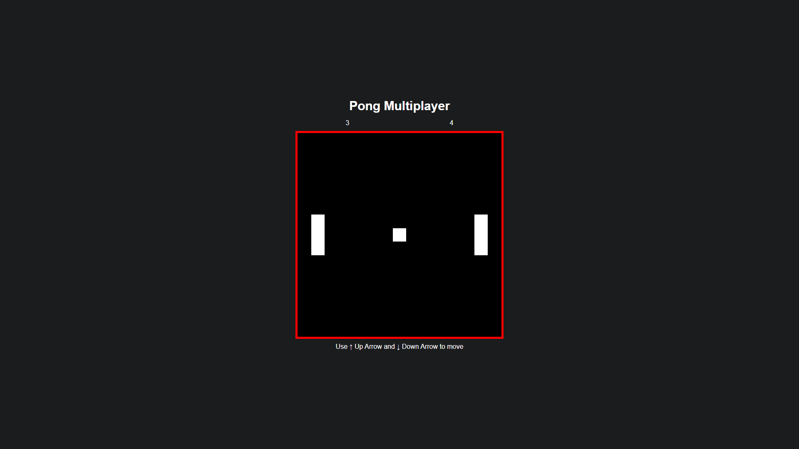

# Pong game multiplayer

Multiplayer Pong Game with SocketIO




## 🚀 Installation

Clone Repository:

```Shell
git clone https://github.com/Lucas8x/pong-game-multiplayer.git
```

Enter folder:

```Shell
cd pong-game-multiplayer
```

Install dependencies:

```Shell
npm install
```

Run server:

```Shell
npm run dev2
```

Access at <http://localhost:3333>

## 📝 License

This project is under [MIT](./LICENSE) license.
